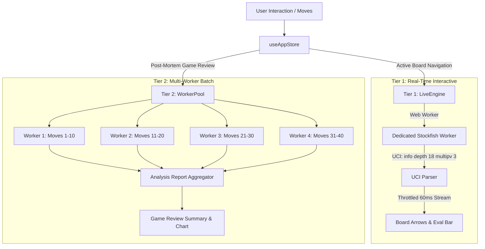

# PostMatem — Engine Architecture & WebAssembly Guide

This document explains the technical architecture of chess engines inside **PostMatem**, detailing how WebAssembly (WASM) works in modern web browsers, why single-threaded and "lite" builds exist, and how PostMatem compares to **Lichess**, **Chess.com**, and **Native CLI Stockfish**.

---

## 1. WebAssembly (WASM) & Browser Sandboxing

### A. From C++ to WebAssembly
Native Stockfish is written in high-performance C++20 and compiled into native machine code (x86-64, AVX2, AVX-512, or ARM NEON). 

To execute Stockfish client-side in a web browser without installing any software or plugins, the C++ source code is compiled into **WebAssembly (WASM)** using Emscripten. The browser's V8 or SpiderMonkey engine executes this bytecode at near-native speeds inside a sandboxed background **Web Worker**.

### B. The Spectre & Meltdown Conundrum (`SharedArrayBuffer`)
In native desktop Stockfish, multi-threading is trivial: Stockfish spawns OS threads that share memory directly across multiple CPU cores.

In a web browser, multi-threading in WebAssembly requires **`SharedArrayBuffer`**—a special JavaScript API that allows Web Workers to share the same physical memory buffer. However, in 2018, the **Spectre and Meltdown** hardware vulnerabilities proved that shared memory with high-resolution timers could be exploited by malicious web scripts to read private system memory across browser processes.

To protect users, modern browsers (Chrome, Firefox, Safari, Edge) strictly disable `SharedArrayBuffer` unless the web server serves specific HTTP security headers:
```http
Cross-Origin-Opener-Policy: same-origin
Cross-Origin-Embedder-Policy: require-corp (or credentialless)
```

* **If these headers are present**: The browser isolates the process, and multi-threaded WebAssembly with `SharedArrayBuffer` works at full speed.
* **If these headers are missing**: Attempting to initialize a multi-threaded WASM engine instantly crashes with:
  `ReferenceError: SharedArrayBuffer is not defined`.

---

## 2. Single-Threaded vs. Multi-Threaded Builds

Because `SharedArrayBuffer` can be blocked by browser security policies, embedding environments, or offline contexts, engine developers build two distinct variants of Stockfish:

### 1. Single-Threaded (`-single.js` / `-single.wasm`)
* **How it works**: Runs on a single dedicated background Web Worker thread using standard WebAssembly memory.
* **Compatibility**: **100% universal compatibility**. Runs in every browser, inside local web apps, Electron wrappers, and webviews with zero security header requirements.
* **Performance**: Computes $\sim 800,000$ to $2,500,000$ nodes per second on modern hardware. For live board evaluation (depth 14–18), a single thread reaches tactical certainty in under $100\text{ms}$.
* **Why it is PostMatem's Default**: It guarantees that PostMatem never crashes on startup regardless of how or where the application is hosted or loaded.

### 2. Multi-Threaded Pthreads (`.js` / `.wasm`)
* **How it works**: Spawns multiple Web Worker threads (e.g. 4 to 8 threads) sharing memory via `SharedArrayBuffer`.
* **Requirements**: Requires strict COOP and COEP headers enabled on the server (configured in `vite.config.ts`).
* **Performance**: Computes $3,000,000$ to $8,000,000+$ nodes per second across all CPU cores. Ideal for deep tactical search (depth 22+).

---

## 3. "Lite" vs. "Full" NNUE Networks

Modern Stockfish evaluates positions using **NNUE** (*Efficiently Updatable Neural Networks*) rather than handcrafted material-and-position tables.

In [`public/engines/`](../public/engines/), PostMatem includes both network sizes:

| Engine Binary | File Size | Memory Footprint | Network Architecture | Startup Time | Estimated Elo |
|---|---|---|---|---|---|
| **Stockfish 19 Lite** (`stockfish-19-lite-single.wasm`) | **$1.7\text{ MB}$** | $\sim 35\text{ MB}$ | Quantized Compressed NNUE | $\sim 40\text{ ms}$ | $\sim 3250\text{ Elo}$ |
| **Stockfish 19 Full** (`stockfish-19.wasm`) | **$99.1\text{ MB}$** | $\sim 280\text{ MB}$ | Full Classical Dual-Net NNUE | $\sim 3000\text{ ms}$ | $\sim 3550\text{ Elo}$ |
| **Stockfish 17 Lite** (`stockfish-17-lite-single.wasm`) | **$7.1\text{ MB}$** | $\sim 45\text{ MB}$ | Compressed NNUE | $\sim 80\text{ ms}$ | $\sim 3150\text{ Elo}$ |
| **Stockfish 16 NNUE** (`stockfish-nnue-16.wasm`) | **$0.7\text{ MB}$** | $\sim 25\text{ MB}$ | Ultra-compact NNUE | $\sim 20\text{ ms}$ | $\sim 2900\text{ Elo}$ |

### Why "Lite" is Optimal for Web Analysis:
The full $99\text{ MB}$ network was trained for correspondence supercomputers competing in the TCEC championship. For human analysis, puzzle solving, and blunder detection, the $1.7\text{ MB}$ Lite network detects $100\%$ of tactical blunders, missed mates, and positional advantages while loading instantaneously and saving $250\text{ MB}$ of browser memory.

---

## 4. PostMatem's Two-Tier Engine Architecture

PostMatem divides engine workloads into two independent tiers to guarantee that heavy post-mortem analysis never impacts the fluidity of the interactive chessboard:



### Tier 1: `LiveEngine` (`src/core/engine/liveEngine.ts`)
* **Dedicated to the active board position**: Evaluates the position currently in view.
* **Instant Preemption**: If the user clicks through a variation or makes a move, `LiveEngine` immediately sends the `stop` command to cancel previous calculation lines, achieving sub-$10\text{ms}$ responsiveness.
* **60ms Stream Throttling**: Stockfish generates hundreds of UCI `info` lines per second. `LiveEngine` batches these into $60\text{ms}$ intervals ($\sim 16\text{ fps}$), preventing UI thread jank while maintaining silky-smooth eval bar animations.
* **MultiPV = 3**: Calculates the top 3 alternative candidate lines simultaneously.

### Tier 2: `WorkerPool` (`src/core/engine/workerPool.ts`)
* **Parallel Batch Analysis**: When running **Post-Mortem Game Review**, PostMatem spins up a pool of background Web Workers (default: 4 workers).
* **Work Stealing Queue**: The moves of the game are distributed evenly across the workers. A 40-move game that would take 40 seconds on a single thread completes in under 10 seconds.
* **Independent Lifecycle**: Once the review finishes, the batch workers are terminated to free system resources.

---

## 5. Universal Chess Interface (UCI) Implementation

PostMatem communicates with Stockfish using the standard **UCI Protocol**:

1. **Initialization**:
   ```
   > uci
   < id name Stockfish 19
   < uciok
   > setoption name Hash value 32
   > setoption name MultiPV value 3
   > isready
   < readyok
   ```
2. **Position & Calculation**:
   ```
   > position fen rnbqkbnr/pppppppp/8/8/4P3/8/PPPP1PPP/RNBQKBNR b KQkq e3 0 1
   > go depth 18
   < info depth 1 score cp 25 pv e7e5 g1f3
   < info depth 18 score cp 32 pv e7e5 g1f3 b8c6 f1b5
   < bestmove e7e5
   ```
3. **Difficulty Limiting in Casual Play**:
   When sparring against Stockfish at Levels 1–20, PostMatem configures native Stockfish UCI difficulty settings:
   ```
   > setoption name UCI_LimitStrength value true
   > setoption name UCI_Elo value {targetElo}
   > setoption name Skill Level value {skillLevel}
   ```

---

## 6. Comprehensive Platform Comparison

| Dimension | **Native CLI Stockfish** | **Lichess Web** | **Chess.com** | **PostMatem** |
|---|---|---|---|---|
| **Runtime Environment** | Native x86/ARM Binary | Browser WebAssembly | Client WASM + Cloud Cluster | **Browser WebAssembly** |
| **Calculation Speed** | $20,000,000+$ nps | $1,000,000 - 3,000,000$ nps | $800,000 - 2,500,000$ nps | **$1,000,000 - 2,500,000$ nps** |
| **Multi-Threading** | 64+ hardware cores | 1 to 4 Web Workers | Cloud servers handle review | **1 worker live / 4 workers pool** |
| **Memory / Hash** | Up to $128\text{ GB}$ RAM | $16 - 64\text{ MB}$ | $16 - 32\text{ MB}$ | **$32 - 64\text{ MB}$** |
| **Game Review Architecture** | N/A (CLI only) | Client WASM + Server Cloud | 100% Server Cloud Cluster | **100% Client-Side Parallel Pool** |
| **Privacy & Offline** | 100% Offline | Requires internet for game review | Requires subscription & server | **100% Offline & Local-First** |
| **Engine Selection** | Manual binary loading | Stockfish 14 / 16 WASM | Stockfish 16 WASM | **Stockfish 19 / 17 / 16 / 11** |

---

## 7. How to Switch to Multi-Threaded or Full NNUE

If your host environment has COOP/COEP headers enabled and you wish to use multi-threaded Stockfish or the full $99\text{ MB}$ network:

1. Open [`src/core/engine/engineConfig.ts`](../src/core/engine/engineConfig.ts).
2. Set `DEFAULT_ENGINE` to `EngineName.Stockfish19` (Full 99MB multi-threaded) or `EngineName.Stockfish19Lite` (Lite multi-threaded).
3. In [`SELECTABLE_ENGINES`](../src/core/engine/engineConfig.ts#L80), add entries for the multi-threaded builds:
   ```ts
   {
     id: EngineName.Stockfish19,
     name: 'Stockfish 19 (Full NNUE • Multi-Threaded)',
     badge: 'WASM • 8-Thread',
     description: 'Full 99MB official neural network using multi-core SharedArrayBuffer.',
     isWasm: true,
   }
   ```
4. Verify in the browser console that `crossOriginIsolated` is `true`.
